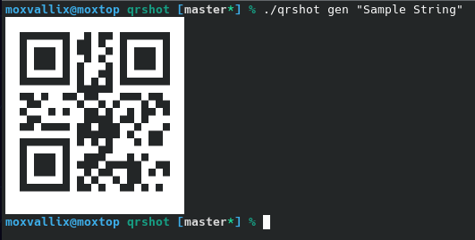

# qrshot
Decode QR code on screen, or encode a string then echo QR code on terminal, on Linux.

This project is a fork of the QRshot script by Gary Williams.
However, much of the current code within the script is by Moxvallix.

As the previous script was open source, but lacked a license, I am releasing my script under the GPLv3.

## Usage
```
qrshot grab                        - opens screenshot dialog and scans qr code
       grab open                   - opens screenshot dialog and scans qr code, opening any URLs
       grab clip                   - opens screenshot dialog and scans qr code, copying it to clipboard
qrshot read <location>             - scans qr code from file
       read open <location>        - scans qr code from file, opening any URLs
       read clip <location>        - scans qr code from file, copying it to clipboard
qrshot gen <string>                - generates a qr code from a string
       gen img <string> <location> - generates a qr code from a string, saving it as a png in the current directory, or to specified location
       gen clip <string>           - generates a qr code from a string, saving it as a png and copying it to the clipboard
qrshot clip                        - generates a qr code from the clipboard
       clip img <location>         - generates a qr code from the clipboard, and saves the png image to the current directory, or the specified location
       clip copy                   - generates a qr code from the clipboard, saving it as a png and copying it to the clipboard
```

### Encode

```
$ qrshot gen "Sample string"
```


\<string\>: Text, in quotes, to encode  
\<location\>: Location of the directory to store the image. Defaults to the current directory. The image is named after the date / time.

## Dependencies

- spectacle - screen capturer
- imagemagick - image processor
- zbar - image QR decoder
- qrencode - QR encoder
